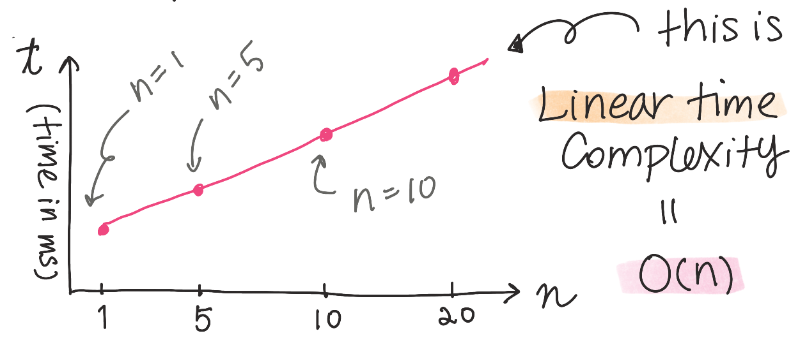
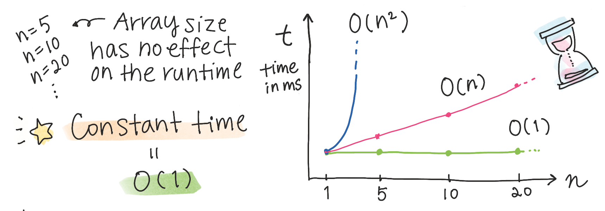

# Big-O Notation

## O(n) Linear Time Complexity

<mark>Runtime</mark>
"How much time it takes to run a function as the size of the input grows."

```
const reactions = [😈, 🤠, 😎, 🤩, 🤯]
```

<mark>reactions</mark>
number of elements n = 5

Let's see if within the <mark>reactions</mark> array, how many times I've blown your mind!

```
reactions = [😈, 🤠, 😎, 🤩, 🤯]
mindBlown = 🤯

const mindBlown = (reactions, mindBlown) => {
    let count = 0;
    for (let i = 0; reactions.length; i++) {
        if (reactions[i] === mindBlown) count++
    }
    return count
}

// Output: 1
```

How long it takes to execute when the number of elements (n) is:



Execution time grows linearly as the array size increases. We can react as many times as we want and the for loop runtime will grow linearly with how many times we react!


## O(1) Constant Time Complexity

Now imagine if we did not have an array and instead we had a object of key/value pairs:

```
const object1 = {
    😈: 1,
    🤠: 1,
    😎: 1,
    🤩: 1,
    🤯: 1
}
```

Object size has no affect on runtime at all based on what we know about objects and lookup methods.


```
reactions = {
    😈: 1,
    🤠: 1,
    😎: 1,
    🤩: 1,
    🤯: 1
}
mindBlown = 🤯

const mindBlown = (reactions, mindBlown) => {
    if (reactions[mindBlown]) {
        return reactions[mindBlown]
    } else {
        throw new SillyError("that emoji don't exist, bro")
    }

}

// Output: 1
```

By virtue of not having to loop through anything our runtime is not effected at all. Trivially we return a single value without having to wait for anything to run.



## O(n^2) Quadratic Time Complexity

Let's run back to our first example.

```
const reactions = [😈, 🤠, 😎, 🤩, 🤯]
```

Now imagine we want to check how many times you felt like a cowboy and immediately felt like a cool guy right after. Let's write out what that function might look like:

```
reactions = [😈, 🤠, 😎, 🤩, 🤯]
cowboy = 🤠
coolGuy = 😎

const cowboyToCoolGuy = (reactions, cowboy, coolGuy) => {
    let count = 0;

    // Loop through the array which is a O(n) operation
    for (let i = 0; reactions.length; i++) {
        // Loop through the array again for every element in the array
        // We start at i + 1 because we always want to check the adjacent element
        for (let j = i + 1; reactions.length; j++) {
            if (reactions[i] === cowboy && reactions[j] === coolGuy) {
                count++
            }
        }
    }
    return count
}

// Output: 1
```

Now because our outer [i] for loop will only take it's step only when the inner [j] loop, loops through the whole array we can assume O(n^2) complexity.

Here's an example of what's happening step by step
```
First loop
reactions = [😈, 🤠, 😎, 🤩, 🤯]
[i] = 😈
[j] = 🤠

Second loop
reactions = [😈, 🤠, 😎, 🤩, 🤯]
[i] = 😈
[j] = 😎

Third loop
reactions = [😈, 🤠, 😎, 🤩, 🤯]
[i] = 😈
[j] = 🤠

Fourth loop
reactions = [😈, 🤠, 😎, 🤩, 🤯]
[i] = 😈
[j] = 😎

Fifth loop
reactions = [😈, 🤠, 😎, 🤩, 🤯]
[i] = 😈
[j] = 🤠

Sixth loop
reactions = [😈, 🤠, 😎, 🤩, 🤯]
[i] = 😈
[j] = 🤩

Seventh loop
reactions = [😈, 🤠, 😎, 🤩, 🤯]
[i] = 😈
[j] = 🤯

Eigth loop
reactions = [😈, 🤠, 😎, 🤩, 🤯]
[i] = 🤠
[j] = 😎
```

You see how we don't move past the first element until we've completely run through the entire array? The process of nesting for loops that when both of their base cases (reactions.length) are the same number, will create a runtime proportional to O(n^2).

Hope this was helpful!
YYYYYEEEEEEEEEEEEEEHHHHHHHAAAAAAAAAWWWWW
